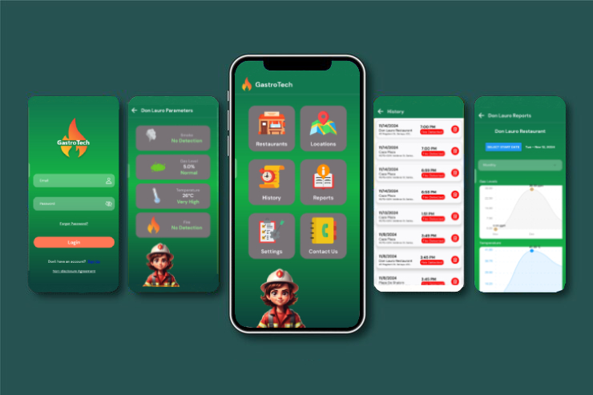
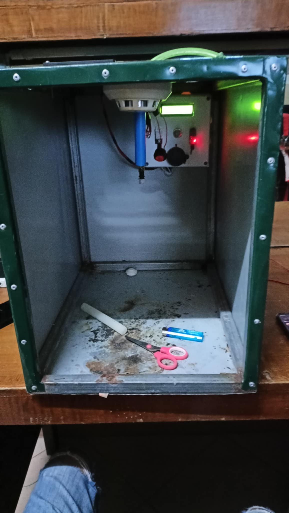
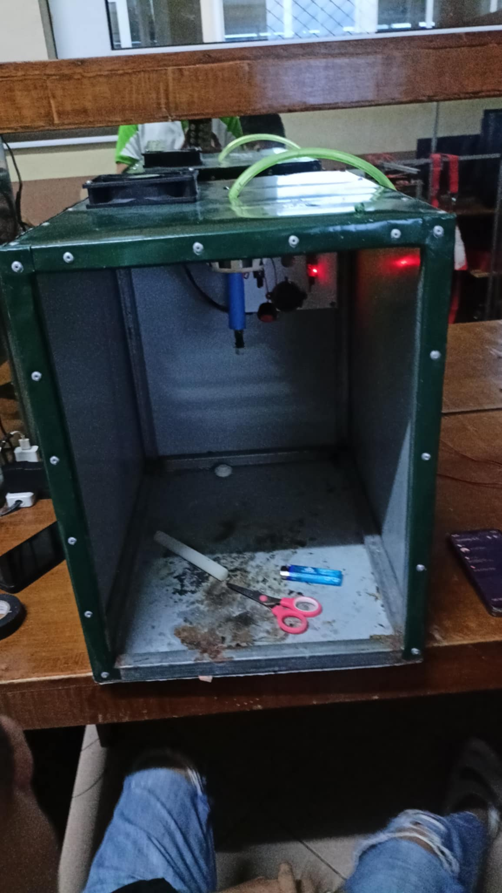

# GastroTech - Restaurant Monitoring System

**GastroTech** is an advanced **restaurant monitoring system** designed to ensure the safety and well-being of restaurants by monitoring critical environmental parameters. It tracks **temperature**, **fire**, **smoke**, and **gas** levels in **3 restaurants** in **Sariaya, Quezon**, and responds to emergencies by activating a **water sprinkler** and **exhaust system**. Built using **React Native**, **Expo**, **Firebase**, and powered by **ESP8266**, **DHT22**, **MQ2 Gas Sensor**, **SIM800L** module, the system sends real-time alerts and logs via SMS when dangerous conditions are detected. The app ensures real-time monitoring, logging, and automation for safety in restaurant environments.

## Features

- **Real-Time Monitoring**: Tracks temperature, fire, smoke, and gas levels in each restaurant in real time.
- **SMS Alerts**: Sends SMS notifications if abnormal conditions (temperature, fire, smoke, or gas) are detected using the **SIM800L** module.
- **Automated Response**: 
  - **Water Sprinkler**: Activates automatically if fire is detected, helping to suppress flames.
  - **Exhaust Fan**: Activates automatically if smoke or high gas levels are detected to improve air quality and ventilation.
- **Environmental Sensors**:
  - **DHT22**: Monitors the temperature and humidity levels.
  - **MQ2 Gas Sensor**: Detects smoke and gas leaks in the restaurant environment.
  - **Fire Detection**: Monitors for fire hazards.
- **Data Logging**: Logs all sensor readings in **Firebase** for real-time data tracking and historical records.
- **User Interface**: A user-friendly app interface to monitor the status of all restaurants and sensor readings in real time.

## Installation

### Prerequisites

Make sure the following tools are installed:

- **Node.js** (latest version)
- **Expo CLI**
- **React Native**
- **Firebase Account** (for real-time data storage and notifications)
- **ESP8266** (for Wi-Fi connectivity)
- **DHT22** (for temperature and humidity sensing)
- **MQ2 Gas Sensor** (for detecting smoke and gas)
- **SIM800L** (for SMS notifications)
- **Water Sprinkler** and **Exhaust Fan** (for automatic system response)

### Steps

1. Clone the repository:

    ```bash
    https://github.com/DevMike13/GastroTech.git
    cd GastroTech
    ```

2. Install dependencies:

    ```bash
    npm install
    ```

3. Install Expo CLI (if not already installed):

    ```bash
    npm install -g expo-cli
    ```

4. Set up Firebase:
   - Create a Firebase project and configure it in your app.
   - Get the Firebase config and add it to the `firebaseConfig.js` file in your project.

5. Program the **ESP8266**:
   - Use **Arduino IDE** to program the **ESP8266** with sensors and the **SIM800L** module for SMS alerts.
   - Install necessary libraries such as `ESP8266WiFi`, `FirebaseESP8266`, `DHT`, and `MQ2` for the sensors.
   - Upload the code to the **ESP8266**, which monitors the restaurant environment and sends data to Firebase.

6. Run the application:

    ```bash
    npx expo start
    ```

7. Open the app in the **Expo Go** app on your phone, or use an **Android/iOS** emulator to run the app.

## Usage

1. **Real-Time Monitoring**: The app displays real-time sensor readings, including temperature, humidity, smoke, gas, and fire detection for all 3 restaurants.
2. **Automated Responses**: When dangerous conditions are detected:
   - **Water Sprinkler**: The water sprinkler system will be triggered if a fire is detected.
   - **Exhaust Fan**: The exhaust fan will turn on if gas or smoke levels exceed safe thresholds.
3. **SMS Alerts**: If any dangerous environmental condition is detected, the app will send an SMS notification to the restaurant management using the **SIM800L** module.
4. **Sensor Logs**: The app logs sensor readings in **Firebase**, allowing for historical data analysis and real-time monitoring.

## Firebase Integration

The app uses Firebase for:

- **Real-Time Database**: Storing real-time data for all sensor readings.
- **SMS Alerts**: The system logs any abnormal environmental readings and triggers alerts via SMS using the **SIM800L** module.
- **Data Logging**: Stores historical sensor data for analysis and future reference.

## Technologies Used

- **React Native**: For building the cross-platform mobile app.
- **Expo**: For rapid development and testing.
- **Firebase**: For real-time data storage, notifications, and logging.
- **ESP8266**: For Wi-Fi connectivity and sensor data transmission.
- **DHT22**: For monitoring temperature and humidity levels.
- **MQ2 Gas Sensor**: For detecting smoke and gas levels.
- **SIM800L**: For sending SMS notifications to restaurant managers in case of an emergency.
- **Water Sprinkler & Exhaust Fan**: For automatic responses to temperature, smoke, and gas hazards.

## Screenshots

Here’s how the **GastroTech** app looks on mobile devices:

  

## Prototype

Here’s some images of the **GastroTech** sorting machine prototype:

  
